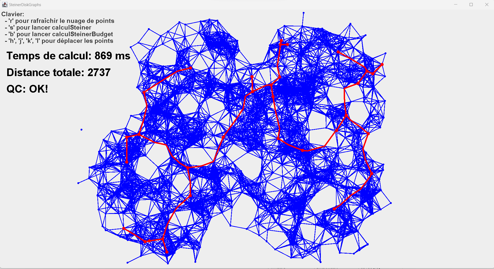
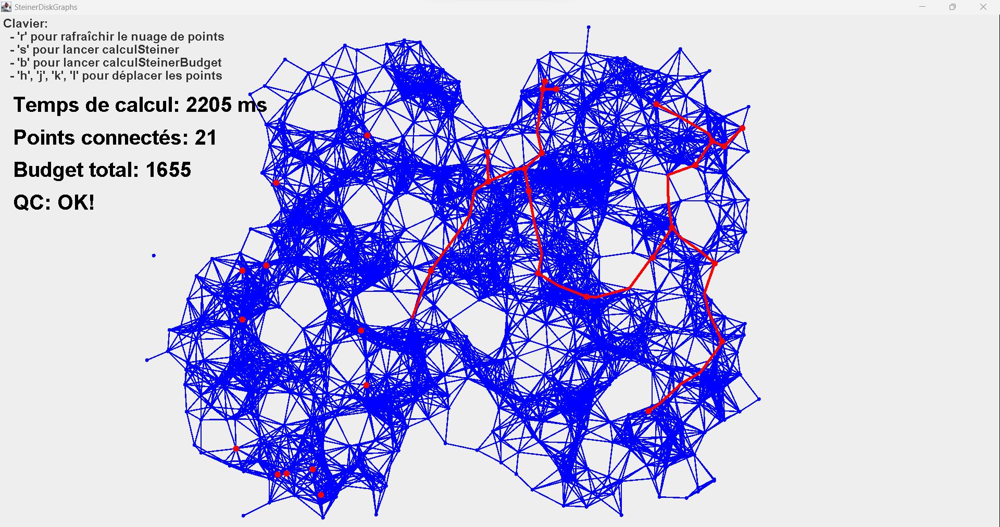

    Ce projet consiste à connecter un ensemble de points dans un plan en minimisant la longueur totale des connexions, en utilisant éventuellement des points intermédiaires appelés points de Steiner.

- **Sans budget** : L’objectif est de trouver l’arbre de Steiner de coût total minimal, sans aucune contrainte. Tous les points doivent être connectés de manière optimale.

- **Avec budget** : L’arbre connecte le plus grand nombre de points possible tout en respectant la contrainte de coût . Si ce n’est pas possible, l’algorithme propose une solution partielle ou échoue.

  
